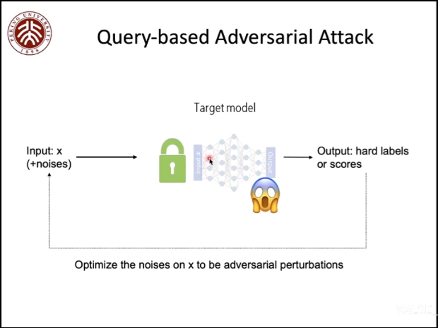

#### Query-based Adversarial attack

不断优化加在噪声的攻击来增加攻击的成功率，但是查询次数可能是有限的，因此查询对抗攻击方法希望尽可能少的查询次数。

根据查询所返回的信息，这类攻击方法被分为两种。

##### 返回one-hot的标签
[Boundary Attack (BA)](https://arxiv.org/abs/1712.04248v2)
先随机化一个点（根据是否有攻击目标有不同的初始化要求），一步步靠近决策边界，然后在决策边界上找到与原始图片最接近的一个点。

[RayS](https://arxiv.org/abs/2006.12792)

##### 返回分数scores
[Zeroth-Order Optimization: ZOO](https://arxiv.org/abs/1708.03999v2)
[AutoZOOM](https://arxiv.org/abs/1805.11770v5)

零阶估计，有限差分来代替梯度
$$\frac{\partial F(x)}{\partial x} \approx \frac{F(x+\delta_i)-F(x)}{\delta_i}$$

[Random search: Square attack](https://arxiv.org/abs/1912.00049v3)
Natural Evolution Strategy: [QL](https://arxiv.org/abs/1804.08598v3), [NAttack](https://arxiv.org/abs/1905.00441v3), [NP-Attack](https://arxiv.org/abs/2009.11508v2)