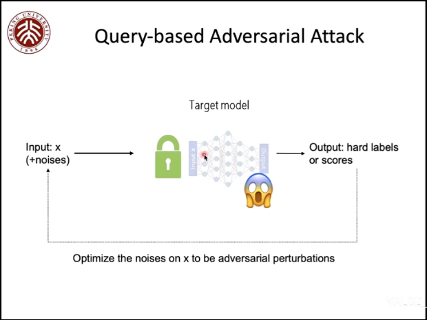
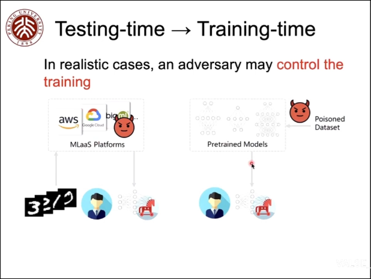
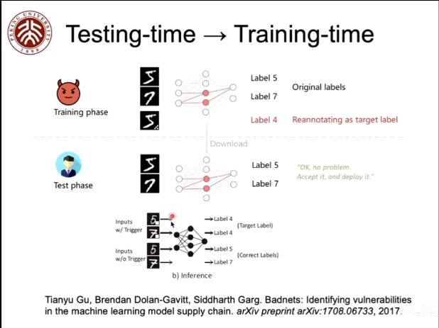
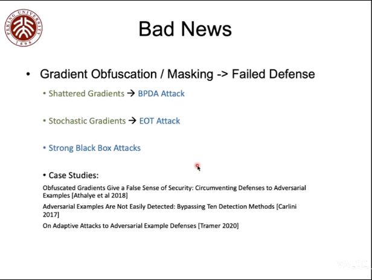

#### Query-based Adversarial attack

不断优化加在噪声的攻击来增加攻击的成功率，但是查询次数可能是有限的，因此查询对抗攻击方法希望尽可能少的查询次数。

根据查询所返回的信息，这类攻击方法被分为两种。

##### 返回one-hot的标签
[Boundary Attack (BA)](https://arxiv.org/abs/1712.04248v2)。

先随机化一个点（根据是否有攻击目标有不同的初始化要求），一步步靠近决策边界，然后在决策边界上找到与原始图片最接近的一个点。

[RayS](https://arxiv.org/abs/2006.12792)。

##### 返回分数scores
[Zeroth-Order Optimization: ZOO](https://arxiv.org/abs/1708.03999v2)，
[AutoZOOM](https://arxiv.org/abs/1805.11770v5)。

零阶估计，有限差分来代替梯度

$$\frac{\partial F(x)}{\partial x} \approx \frac{F(x+\delta_i)-F(x)}{\delta_i}$$

[Random search: Square attack](https://arxiv.org/abs/1912.00049v3)。

随机搜索，需要损失函数的信息。

Natural Evolution Strategy: [QL](https://arxiv.org/abs/1804.08598v3), [NAttack](https://arxiv.org/abs/1905.00441v3), [NP-Attack](https://arxiv.org/abs/2009.11508v2)。

不再基于有限差分，而是基于周围的分布。核心是学习对抗样本在输入周围的分布。

$$\max_\theta \mathbb{E}_{x' \backsim \pi} L(x', y) \qquad \pi_S(x'|\theta)$$

这样的分布具有非常好的几率破坏DNN的预测，而且减少了攻击维度，因为$\text{dim}(\theta) \ll \text{dim}(x')$

#### Physical Adversarial Example

随机噪声可能带来的扰动会被sensors采样时候给忽略。因此自然环境的目标是对抗样本更自然。[Brown 2017](https://arxiv.org/abs/1712.09665),[Eykholt 2018](https://openaccess.thecvf.com/content_cvpr_2018/papers/Eykholt_Robust_Physical-World_Attacks_CVPR_2018_paper.pdf)。

##### Physical Adversarial camouflage
通过style transfer的方法，模拟落雪，做旧，褪色等实现比遮挡更自然的对抗样本[Duan 2020](https://openaccess.thecvf.com/content_CVPR_2020/papers/Duan_Adversarial_Camouflage_Hiding_Physical-World_Attacks_With_Natural_Styles_CVPR_2020_paper.pdf)。

## Can we attack the training process?
之前方法所攻击的model都是别人已经train好的，是否可以在训练过程中就进行攻击？
如果一个有问题的数据集训练出来的预训练模型是会引发很多意想不到的问题的。

[Badnets](https://arxiv.org/abs/1708.06733)。

攻击方法很多，但是机器学习依然是有用的。需要对我们的机器学习解决方案进行更多的压力测试。

# 如何获得鲁棒的模型（How to obtain adversarially robust models?）
防御比攻击难，因为无法知道攻击是来自何方。一些还行的防御手段会被更强或者更刁钻的攻击给破坏。

[Athalye 2018](https://arxiv.org/abs/1802.00420)，[Carlini 2017](https://arxiv.org/abs/1705.07263), [Tramer 2020](https://arxiv.org/abs/2002.08347)。
